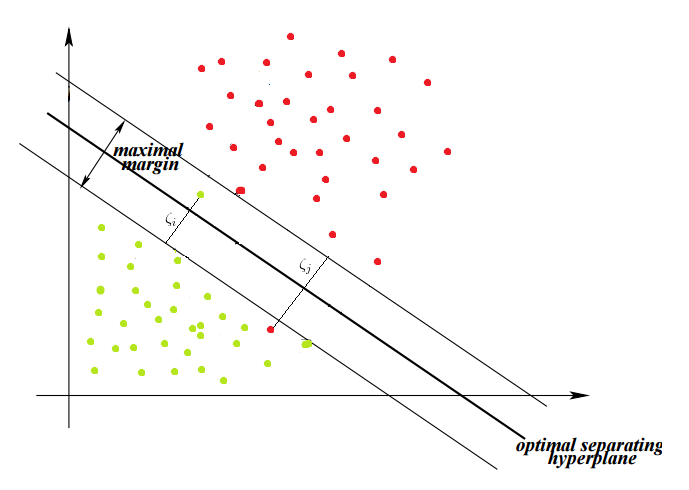

```{r, message = FALSE}
library(caret)
library(e1071)
library(dplyr)
library(kernlab)
library(car)
library(openxlsx)
library(ggplot2)
```

## Part 1: Background

### What is an SVM?

A Support Vector Machine is a non-parametric supervised machine learning algorithm that uses a hyperplane, a separation threshold in p dimensions, to make binary classifications. The optimal hyperplane is the one with the maximal margin where the smallest distance (margin) from the vectors (closest datapoints that influences the choice of optimal planes) are maximized. Because maximal margin hyperplane can be unduly sensitive to new data (potentially overfitting) that are vectors, Support Vector Classifier allows misclassifications to decrease this sensitivity and better perform on new datasets. The tuning of epsilon, or the positive slack variables, [or C?] demonstrates a bias-variance trade-off in SVM. Support Vector Machines further extends this algorithm to cases of non-linear separations between categories by variable transformation.

(A Support Vector Machine is a supervised machine learning algorithm that is suitable for both classification and regression. For a given set of data that is marked as one category or the other of a total of two categories, an SVM algorithm builds a model that assigns new examples to either of the two categories, making it a binary linear classifier. In an SVM model, cases of the dataset are points in a p-dimensional space, mapped so that they are separated by a p-1 dimension hyperplane with maximized gap. New cases are predicted by assigning each new case to either side of the hyperplane.)

### What is a hyperplane?

The hyperplane is a flat affine subspace of demension p-1 in a p dimension space. The goal of the hyperplane is to classify the data points into different categories correctly. The natural choice of hyperplane is maximal margin hyperplane. We calculate the distance of each observation to the hyperplane and define the minimum of the distance as the margin of the hyperplane. There are many hyperplanes but we want the one maximizes the margin. The intuition behind this is that the maximal margin hyperplane can give us a better split because it makes each group/category more distinct from each other by using the maximum of the margin, and our classification are more likely to have a high accuracy. 

### Details of hyperplane

In reality, we usually can't make a perfect split because datasets might just not be linearly separable when observations from different categories mix with each other. Here we introduce the term slack variable $\zeta_i$ which allow some observations to fall off the margin but it penalizes them. Each slack variable is determined by the distance between each misclassified observation and the correct margin. In this scenario, our algorithm tries to keep $\zeta_i$ to zero while maximizing the margin. The tolerance term is defined as $𝐶\Sigma\zeta_i$, where $\Sigma\zeta_i$ is the sum of the distance from each misclassified observation to the correct margin and $𝐶$ is the regularization parameter that controls the trade-off between the slack variable penalty (misclassifications) and width of the margin(just like LASSO!).

### Tuning the regularization parameter



What does the $𝐶$ parameter do in SVM classification? It tells the algorithm how much you care about misclassified points. SVMs, in general, seek to find the maximum-margin hyperplane. That is, the line that has as much room on both sides as possible. A high value for $𝐶$ means that we want the misclassification to be punished hard, which tells the algorithm that we care more about classifying all of the training points correctly than leaving wiggle room for future data, thus the algorithm will produce small margin with low tolerance(low variance, high bias). A low value for $𝐶$ means that we want the misclassification to be hardly punished, which tells the algorithm that we care more about leaving room for future data than classify all of the training points correctly, thus the algorithm will generate a larger margin with higher tolerance(high variance, low bias). To be more precise, when we try to increase $𝐶$, we are betting that our training dataset contains the most extreme cases and future data will be further from the boundary than the cases our training dataset contains. Vice versa. The best $𝐶$ is usually determined using CV.

### What is a kernel trick?

A kernel function is a function which takes two data points as inputs and returns a similarity score, which just indicates how close the points are. The closer the data points, the higher the simialrity score! A cool thing about kernel functions is that in high dimensional spaces, where data could be hard to visualize and deal with, by using a kernel function, we can actually compute the similarity scores without doing any transformation on the data(i.e. reducing the dimension). Thus, a kernel trick is just using kernal function instead of using high-cost transformations.

Common kernel functions that are used for SVM include: Linear kernel function (default kernel function just as the visualization above.), polynomial kernel function(similar to a linear kernel function but just raise the degree of the polynoimal above 1), radial basis kernel function(probably one of the best and practical kernel functions that works well when data points wrangle together, works well when polynoimal kernel funtions not giving satisfying results).

### Tuning parameter of a kernel function, $\gamma$

It's hard to explain how this $\gamma$ parameter really works, but the idea is that when we use kernel functions to find the boundary that's suitable for our dataset, the boundary(or called Gaussian boundary) dissipates as they get further from support vectors and this $\gamma$ parameter basically controls how quickly the dissipation happens. In general, if a large $\gamma$ is chosen, the boundary will dissipate slower, meaning that we have a more fixed boundary and similar to using a large $𝐶$, we are betting that future data will fall within this more fixed boundary thus indicating high bias and low variance. Vice versa!

### Pros and cons of SVM.

Pros:
- The solutions given by SVM are guaranteed to be global minimum instead of locally minimum, due to the nature of the optimization of the method.
- SVM is a spectacular method that is suitable for both linearly and non-linearly separable data sets by using kernel tricks. The only thing to do is to tune the tuning parameter C.
- SVM works well with data sets that have low dimentionality as well as data sets that have high dimensionality. The algorithm works well with high-dimension because the complexity of training data set in SVM is generally characterized by the support vectors rather than the dimension of the data set.
- SVM can work effectively on smaller training data set because it does not rely on the entire data.

Cons:
- SVM is really computationally expensive and thus can not work with large data set.
- SVM is not so good at dealing with data sets that have multiple overlapping classes.

### Comparison among SVM and other classification algorithm

SVM vs. logistic classification: Since logistic classfication can only deal with binary predictors, SVM is just better than logistic in almost every aspect. Though SVM is by default only able to deal with binary predictors as well, as ISLR textbook mentions we can deal with multiclass predictors using techniques called one-versus-one classification or one-versus-all classification.

SVM vs. KNN: In practice, KNN scales badly, gives kind of blocky boundarys and hard-to-explain models. Also, KNN does not work well with high dimensionality datasets. SVM in general does not have this problem and is better.

SVM vs. Tree: Trees are greedy, which gives the locally optimal results rather than global optimal result. SVM is not greedy.

SVM vs. RandomForest: Good things about Randomforests are that randomforest gives a probablistic model that indicates the probability that a given data point falls into a class. Aside from that, SVM usually gives better results when it applies.

Though from above we have come to know that SVM is better than other classification algorithm when it applies, but what about when it doesn't apply? Considering the cons of SVM listed in the previous section, we generally do not want to use SVM when: 1) the given dataset has a lot of data point, say $10^6$, which makes it too computationally inefficient to use SVM; 2) data with many features wrangles together. Though when data wrangles with each other all algorithms tend to perform bad, SVM usually works worse in this case.

## Part 2: 2 predictor analysis

**Ready the data set**
```{r}
kangaroo <- read.csv("https://www.macalester.edu/~ajohns24/data/kangaroo.csv")
set.seed(253)
kangaroo_selected <- kangaroo %>% 
  filter(species != c("melanops")) %>%
  mutate_if(is.factor, ~droplevels(.))
levels(kangaroo_selected$species)

kangaroo_selected %>% 
  count(kangaroo_selected$species)
```

Here we dropped the `melanops` species for the sake of simplicity. As we can see now, there are 50 of the fuliginosus species and 50 of the giganteus species.

**visualization of data**
```{r warning = FALSE}
ggplot(data = kangaroo_selected, aes(x = zygomatic.width, y = nasal.width, color = species)) + 
  geom_point()
```

Since we are now only doing a two-dimension analysis on `zygomatic.width` and `nasal.width`, we can plot the dataset and see what kind of kernel we want to use for our svm model. Luckily, in the plot we can tell that a linear kernel seems fine in this settings and maybe we want a rather small value for the regularization parameter $𝐶$, since there are not so many extreme cases that we want to penalize.

**Two-model build up**
```{r}
#set the seed
set.seed(253)

#Tuning parameter c
c <- seq(0.01, 10, length = 200)
grid <- expand.grid(sigma = c(.01, .015, 0.2), C = c(0.75, 0.9, 1, 1.1, 1.25))

#linear svm model
svm_linear <- train(
  species ~ zygomatic.width + nasal.width,
  data = kangaroo_selected,
  method = "svmLinear",
  trControl=trainControl(method = "cv", number = 10, selectionFunction = "best"),
  preProcess = c("center", "scale"),
  metric = "Accuracy",
  tuneGrid = data.frame(C = c),
  na.action = na.omit
  )

#plot the accuracies
plot(svm_linear)

#filtering out the best Tuning parameter for C
svm_linear$results %>% 
  filter(C == svm_linear$bestTune$C)

#visualization of the Linear split
kernlab::plot(svm_linear$finalModel)
```

```{r}
plot_data <- kangaroo_selected %>%
  select(species, zygomatic.width, nasal.width)

e1071_linear_model <- svm(
  species ~ ., 
  data = plot_data,
  method = "C-classification", 
  kernel = "linear",
  cost = 0.160603)

plot(e1071_linear_model, plot_data, zygomatic.width ~ nasal.width, col = c("pink", "cadetblue1"))
```

As we have mentioned above, a linear kernel seemed suffice for the SVM model, so we first tried out a Linear kernel SVM by using the `caret` package's `svmLinear` method. As we can see from the CV Accuracy plot, the model reached its best accuracy at the point very close to 0, which fits our expectation that only a small $𝐶$ is needed. So we arrived at an accuracy of 0.889 with the tuning parameter $𝐶$ 0.160603, using Cross Validation. Using caret, we were only able to generate a contourplot of the split with another package called `kernlab`, which was not so satisfying. Thus we used the CV results for another package `e1071` to generate one specific SVM model with the optimal tuning parameter that is able to generate a better splitting plot as is shown above. In the plot, the support vectors are marked as $X$, and black mark stands for fuliginosus and red mark stands for giganteus.

```{r}
#svm polynomial model
svm_poly <- train(
  species ~ zygomatic.width + nasal.width,
  data = kangaroo_selected,
  method = "svmPoly",
  trControl=trainControl(method = "cv", number = 10, selectionFunction = "best"),
  preProcess = c("center", "scale"),
  metric = "Accuracy",
  tuneGrid = data.frame(C = c, scale = TRUE, degree = seq(1, 5, length = 5)),
  na.action = na.omit
  )

#Accuracy plot
plot(svm_poly)

#Best tune
svm_poly$results %>%
  filter(C == svm_poly$bestTune$C)
```


The results of the polynomial model can also explain the problem of overfitting. The CV accuracy actually decreases as we increase the degree of the exponent, indicating that we are overfitting the training dataset. Therefore, we should choose the linear hyperplane because our accuracy on the new dataset would be the highest. 

```{r}
svm_poly_1 <- train(
  species ~ zygomatic.width + nasal.width,
  data = kangaroo_selected,
  method = "svmPoly",
  trControl=trainControl(method = "cv", number = 10, selectionFunction = "best"),
  preProcess = c("center", "scale"),
  metric = "Accuracy",
  tuneGrid = data.frame(C = c, scale = TRUE, degree = 2),
  na.action = na.omit
  )

kernlab::plot(svm_poly_1$finalModel)

svm_poly_1$results %>%
  filter(C == svm_poly$bestTune$C)

e1071_quadratic_model <- svm(
  species ~ ., 
  data = plot_data,
  method = "C-classification", 
  kernel = "polynomial",
  degree = 2,
  cost = 0.7630151)

plot(e1071_quadratic_model, plot_data, zygomatic.width ~ nasal.width, col = c("pink", "cadetblue1"))
```

```{r}
#svm RBF model
svm_rbf <- train(
  species ~ zygomatic.width + nasal.width,
  data = kangaroo_selected,
  method = "svmRadial",
  trControl=trainControl(method = "cv", number = 10, selectionFunction = "best"),
  preProcess = c("center", "scale"),
  metric = "Accuracy",
  tuneGrid = data.frame(C = c, sigma = sig),
  na.action = na.omit
)

svm_rbf$results %>%
  filter(C == svm_rbf$bestTune$C)

e1071_rbf_model <- svm(
  species ~ zygomatic.width + nasal.width, 
  data = plot_data,
  method = "C-classification", 
  kernel = "radial",
  gamma = 0.461809,
  cost = 0.461809)

plot(e1071_rbf_model, plot_data, zygomatic.width ~ nasal.width)
```


Though we have convinced ourselves that a Linear split would be the best in this situation, we still attempted multiple degrees of polynomial kernel split, with degrees ranging from 1~5. Not suprisingly, when degree = 1, we had the same highest accuracy of 0.889, but with different $𝐶$, this is because the `svmPoly` method has another tuning parameter scale, which rescales the dataset thus giving a different yet still small $𝐶$. We also used the same technique we used above to plot the quadratic split(we are not going to plot all 5 degrees, since some degrees do not have good accuracys thus the plot should be kind of a mess). In the plot, the support vectors are marked as $X$, and black mark stands for fuliginosus and red mark stands for giganteus.

## Part 3: Full analysis

Because we have all predictors to classify the species, we can't use a single graph to see the relationship before we train our model. We tried linear split, polynomial split, and radial split to see which method gives us the best accuracy. The algorithm below use all the predictors in the datset to create the hyperplane to classify the species. We also use the cross-validation method to account for the problem of overfitting. The algorithm normalizes all the data before the training process, because we don't want our results to be misled by the big data. Our tuning parameters are C which is the cost of the errors, and  

```{r}
#set the seed
set.seed(253)

#Tuning parameter c
c <- seq(0.01, 10, length = 200)
sig <- seq(0.01, 10, length = 200)
grid <- expand.grid(sigma = c(.01, .015, 0.2), C = c(0.75, 0.9, 1, 1.1, 1.25))

#linear svm model
svm_linear_all <- train(
  species ~ .,
  data = kangaroo_selected,
  method = "svmLinear",
  trControl=trainControl(method = "cv", number = 10, selectionFunction = "best"),
  preProcess = c("center", "scale"),
  metric = "Accuracy",
  tuneGrid = data.frame(C = c),
  na.action = na.omit
  )

#svm polynomial model
svm_poly_all <- train(
  species ~ .,
  data = kangaroo_selected,
  method = "svmPoly",
  trControl=trainControl(method = "cv", number = 10, selectionFunction = "best"),
  preProcess = c("center", "scale"),
  metric = "Accuracy",
  tuneGrid = data.frame(C = c, scale = TRUE, degree = seq(1, 5, length = 5)),
  na.action = na.omit
  )

#svm RBF model
svm_rbf_all <- train(
  species ~.,
  data = kangaroo_selected,
  method = "svmRadial",
  trControl=trainControl(method = "cv", number = 10, selectionFunction = "best"),
  preProcess = c("center", "scale"),
  metric = "Accuracy",
  tuneGrid = data.frame(C = c, sigma = sig),
  na.action = na.omit
)

```


**Accuracy plots for the two models**
```{r}
plot(svm_linear_all)
plot(svm_poly_all)
#plot(svm_rbf_all)
```


**The best tuning parameter**
```{r}
svm_linear_all$results %>% 
  filter(C == svm_linear_all$bestTune$C)
svm_poly_all$results %>%
  filter(C == svm_poly_all$bestTune$C)
svm_rbf_all$results %>%
  filter(C == svm_rbf_all$bestTune$C)
```

The CV accuracy of the linear model is 98.75% with the cost of 0.1104, the CV accuracy of the polynomial model is 97.14% with the cost of 0.01, and the CV accuracy of the radial model is 73.63% with the cost of 1.01402. We would choose the linear model which gives us the highest accuracy, and we should expect that our classification of species on the new data would be 98.75% correct. 


**Visualiztion of Full SVM classification**
Since we use all the predictors in this model, the dimension of the graph is too high for us to visualize the hyperplane. Therefore, we can't visualize the SVM hyperplane or the margins because of the high dimension.   


{r}
# Result table
kangaroo_selected$predictions <- predict(svm_linear_all, kangaroo_selected)
table(kangaroo_selected$predictions, kangaroo_selected$species)


** Variable Importance **
{r}
variable_important <- data.frame(importance(svm_linear_all$finalModel)) %>% 
mutate(predictor = rownames(.))

variable_importance %>% 
arrange(desc(…)) %>% 
head(1)


## Part 4: ### moreSummarize


## Part 5: Contributions

